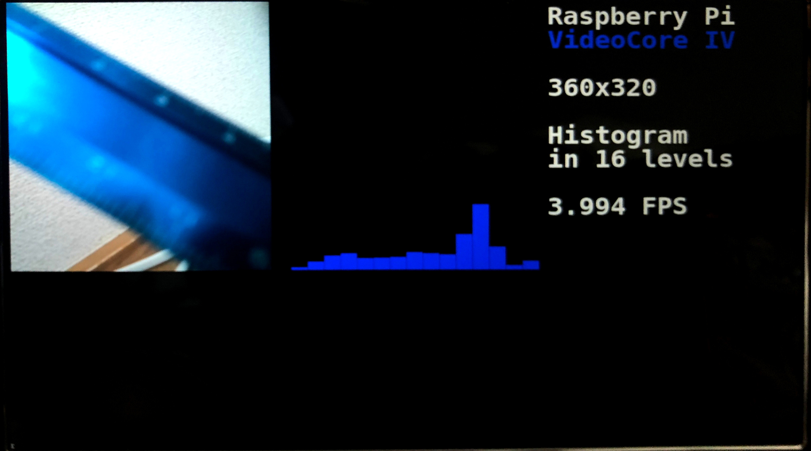

# Image_Analyzer_with_VC4
[セキュリティ・ネクストキャンプ2021 講義N6 低レベルGPUプログラミング](https://www.ipa.go.jp/jinzai/camp/2021/next2021_program_list.html#list_next6)

 
[camera_blue.py](https://github.com/azaberrypi/Image_Analyzer_with_VC4/blob/main/camera_blue.py)の出力映像のスクリーンショット

## 概要
Piカメラで取得している画像から、RGBの明度をヒストグラムで表示するプログラムです。 
RaspberryPiに搭載されているGPU、VideoCore® IVで処理させて高速化を図っています。 
現状では1つのプログラムで1色の明度を16段階で表示しているため、今後拡張して 
・1つのプログラムでRGB全てのヒストグラムを同時に表示する 
・256段階のヒストグラムで表示する 
に対応させたいと考えています。

また、16段階のRのみのヒストグラム表示において、GPUとCPU間で速度比較をするために[camera_cpu_red.py](https://github.com/azaberrypi/Image_Analyzer_with_VC4/blob/main/camera_cpu_red.py)を作成していますが 
雑にPython3で実装しているためCPU側でのベストパフォーマンスは出せていません。

開発に当たってはこちらを参考にしています。 
https://github.com/Taiki-azrs/RaspiGPGPU_guide